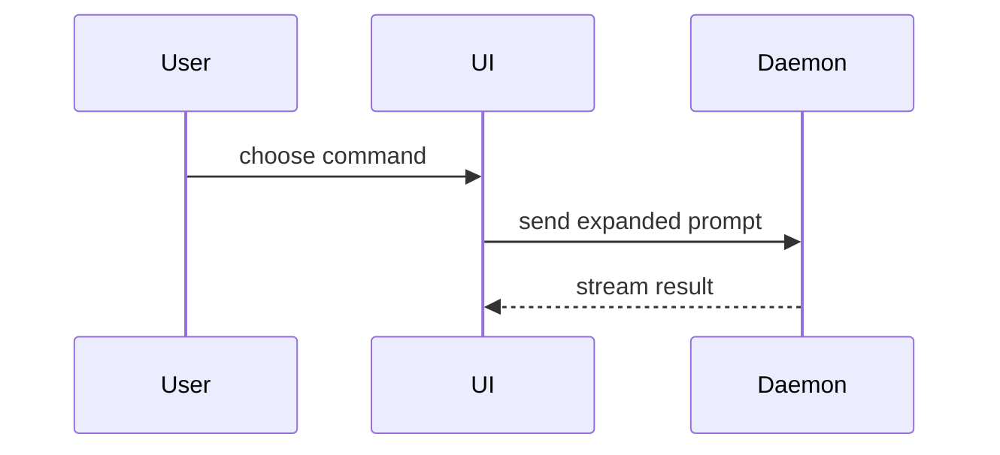

## Human writing

Follow this block for every sentence you write in this skill (chat and the file under `docs/`). Canonical copy: [plain-language.md](../plain-language.md).

Write like a teammate explaining the work across a desk. The reader should hear what a person sees, decides, or does. Do not write a tutorial glossary, an ADR, or a requirements matrix.

These rules apply to chat and to files under `docs/`. They do not replace "lead with the next action."

- Chat: the first line is still the next action (a command, path, or decision). Do not open with a glossary.
- One idea per sentence. If a sentence has two dashes or three clauses, split it.
- Everyday words where they exist. Human meaning first, then the machine name: sign-in (`login`), not `the login route`.
- Headers state the takeaway, not a topic label. Bad: `Current State`. Good: `The advertised tool looks like it takes no arguments`.
- Keep every fact a specialist needs: file paths, commands, flags, phase names, test modes (`tdd`, `characterization-then-tdd`, `exempt`), line numbers, and caveats. Do not invent a synonym for those.
- Do not cite FR/NFR/ADR/ARC numbers unless the reader must open that file. Prefer `Per the ticket` or `The research doc notes`.
- Keep full depth. Plain words, not less content.
- If a sentence needs a second read, rewrite it.
- Do not write a sibling `.plain.md`. Write it plainly the first time.


# Teach me

Help the user understand the current topic of conversation visually. Skip the preamble and keep prose brief. Pick the smallest view that makes the key point clear.

- Show logic or an algorithm as pseudocode:

```text
on(save)
  if content is unchanged
    return cached result
  write new content
  return fresh result
```

- Show runtime control flow as a call tree:

```text
submitForm
  createSession
    persistPrompt
    launchAgent
  navigateToSession
```

- Show UI structure as a component tree, including state and module boundaries that matter:

```tsx
<SessionPage> (apps/example/src/routes/session.tsx)
  useSessionEvents()
  <SessionToolbar>
    <RunSkillButton> (packages/ui)
```

- Show file responsibility or a broad refactor as a shallow file tree:

```text
src/
├── commands/       # parses user actions
├── sessions/       # owns session state
└── transport/      # sends API requests
```

- Show component interaction, control flow, or data flow with Mermaid:



- Use `diff` when the point is what changes and the surrounding shape already exists. Match the diff shape to the topic.

For a component change:

```diff
 <SessionPage>
   useSessionEvents()
   <SessionToolbar>
+    <RunSkillButton />
   <SessionTimeline>
+    <SkillResultCard />
```

For a file-layout change:

```diff
 src/
 ├── commands/
+│   └── teach-me.ts       # expands the slash command
 ├── sessions/
-└── transport.ts
+└── transport/
+    ├── client.ts
+    └── stream.ts
```

For a call-tree or call-stack change:

```diff
 submitForm
   createSession
     persistPrompt
+    expandSkillMention
     launchAgent
-  navigateToSession
+  navigateToSession
+    subscribeToEvents
```

For a state or control-flow change:

```diff
 on(save)
-  write content
+  if content is unchanged
+    return cached result
+  write new content
+  invalidate cache
```

- Show the whole block when most of it is new, when omitted context would hide ownership or order, or when the user needs a copyable target shape:

```ts
function expandSkill(command: string): string {
  const skillName = command.slice(1)
  return `use the ${skillName} skill`
}
```

- For a visual UI, layout, state comparison, or concept too dense for Mermaid, create one focused HTML artifact. Match the product's colors, type, spacing, and components; use real labels and data; support desktop and mobile; then display it inline:

```artifact-embed
docs/teach-me-{description}.html
```

- Place each visual next to the short text it supports. Keep only the calls, files, props, states, and boundaries needed to answer the user's current question.
